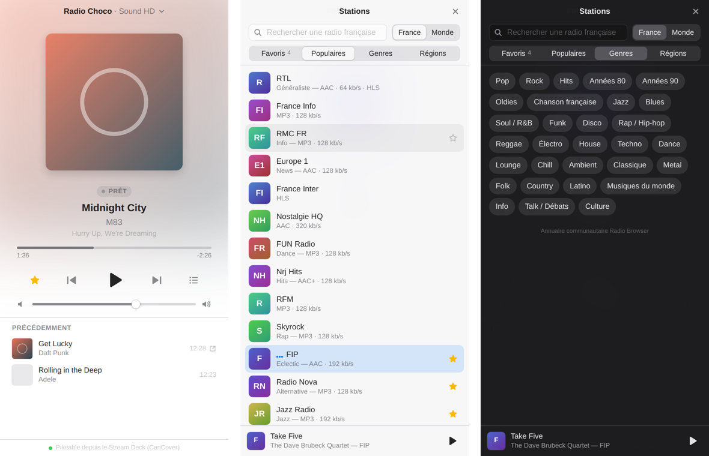

# CariRadio

Mini lecteur de radios pour macOS, pilotable depuis le Stream Deck. Un outil [Caribou Labs](https://github.com/CaribouNathan).

- **Des milliers de radios** : recherche, *Populaires*, *Genres*, *Régions* (France) ou *Pays* (Monde), favoris —
  grâce à l'annuaire communautaire ouvert [Radio Browser](https://www.radio-browser.info).
- **Titre en cours et pochette** : métadonnées du flux (ICY) + pochette et lien Apple Music via iTunes Search.
  Sans pochette, le logo de la station prend sa place.
- **Radio Choco — Sound HD** intégrée nativement (pochette, progression et historique via RadioKing).
- **Flux HLS** (RTL, Radio France…) lus avec [hls.js](https://github.com/video-dev/hls.js).
- **Stream Deck** : API locale sur `127.0.0.1:32700`, utilisée par le plugin CariCover.
- Centre de contrôle macOS et touches média (⏮ ⏭ = favori précédent / suivant). Clair/sombre automatique.
- **Aucun accès au micro** : signée avec le runtime renforcé sans droit d'entrée audio, l'app ne peut pas y accéder
  et macOS ne pose pas la question.

## Installation

1. Télécharger la dernière version dans [Releases](https://github.com/CaribouNathan/CariRadio/releases) :
   `…-mac-arm64.dmg` pour un Mac Apple Silicon (M1 et suivants), `…-mac-x64.dmg` pour un Mac Intel.
2. Ouvrir le `.dmg` et glisser **CariRadio** dans **Applications**.
3. Premier lancement : l'app n'est pas notarisée par Apple, macOS peut donc la bloquer.
   - **Réglages Système › Confidentialité et sécurité**, en bas : **Ouvrir quand même**, puis confirmer ;
   - ou, dans le Terminal : `xattr -dr com.apple.quarantine /Applications/CariRadio.app`

## Raccourcis
| | |
|---|---|
| Espace | Lecture / pause (hors champ de recherche) |
| ⌘K | Choisir une station |
| ⌘1 … ⌘9 | Favoris 1 à 9 (menu **Stations**) |
| ⌘] / ⌘[ | Favori suivant / précédent |
| ⌘D | Ajouter / retirer la station des favoris |
| ⌘↑ / ⌘↓ | Volume |

Fermer la fenêtre ne coupe pas la radio (⌘Q pour quitter).

## API de contrôle locale (127.0.0.1:32700)
`GET /state` · `GET /stations` (favoris + station en cours)
`POST /play` `/pause` `/toggle` `/stop` `/show`
`POST /volume?value=0-100` `/volume/up?step=5` `/volume/down?step=5`
`POST /station?id=<id>` (favori ou identifiant Radio Browser) · `POST /station/next` · `POST /station/prev`

`/state` renvoie la station (`station.name`, `station.subtitle`, `station.favicon`, `station.codec`,
`station.bitrate`, `station.favorite`…), le morceau (`track`), l'historique (`history`), les favoris, et `artwork`
(pochette, ou logo de la station). Quand le morceau n'a pas de pochette, `track.cover` contient le logo et
`track.coverIsStation` vaut `true`.

Écoute locale uniquement : l'API n'est pas joignable depuis le réseau.

## Compiler soi-même
Node.js 20 ou plus, Xcode Command Line Tools.

- Double-clic sur `build.command` → `release/mac-arm64/CariRadio.app` (signature ad hoc).
- Ou `scripts/package-mac.sh arm64` (ou `x64`) → `.zip` et `.dmg` dans `release/`.

Electron + React + TypeScript + Vite. Réglages : `~/Library/Application Support/CariRadio/config.json`.
Journal d'erreurs : `~/Library/Logs/CariRadio/cariradio.log` (menu Aide › Afficher le journal d'erreurs).

## Publier une version
1. Changer `version` dans `package.json` et ajouter la section correspondante dans `CHANGELOG.md`.
2. Double-clic sur `publier-sur-github.command` (GitHub CLI requis : `brew install gh`).
   Le script enregistre les modifications, les envoie, pose le tag `vX.Y.Z` ; GitHub Actions compile les versions
   Apple Silicon et Intel et crée la release avec les `.dmg` et `.zip`.

Signature Developer ID et notarisation (facultatif, compte Apple Developer requis) : ajouter dans
*Settings › Secrets and variables › Actions* les secrets `MAC_CERT_P12_BASE64` (certificat .p12 en base64),
`MAC_CERT_PASSWORD`, `MAC_SIGN_IDENTITY` (ex. `Developer ID Application: Nom (TEAMID)`), `APPLE_ID`,
`APPLE_TEAM_ID` et `APPLE_APP_PASSWORD` (mot de passe d'app). Sans ces secrets, l'app est signée ad hoc.

## Crédits
- Annuaire des stations : [Radio Browser](https://www.radio-browser.info) (données communautaires ouvertes).
- Métadonnées Radio Choco : API publique RadioKing. Pochettes : API iTunes Search.
- Lecture HLS : [hls.js](https://github.com/video-dev/hls.js) (Apache 2.0).

CariRadio n'est affilié à aucune des radios accessibles, ni à Radio Browser, RadioKing ou Apple. Les flux, noms et
logos des stations appartiennent à leurs propriétaires respectifs ; CariRadio ne fait que les lire.

## Licence
[MIT](LICENSE) © 2026 Nathan Carrillat — Caribou Labs
